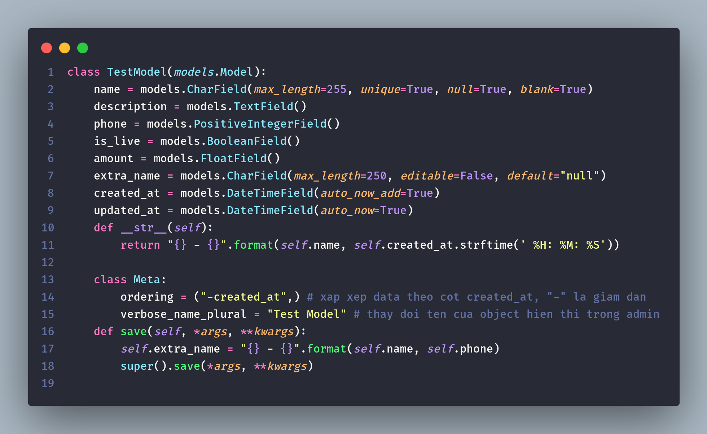
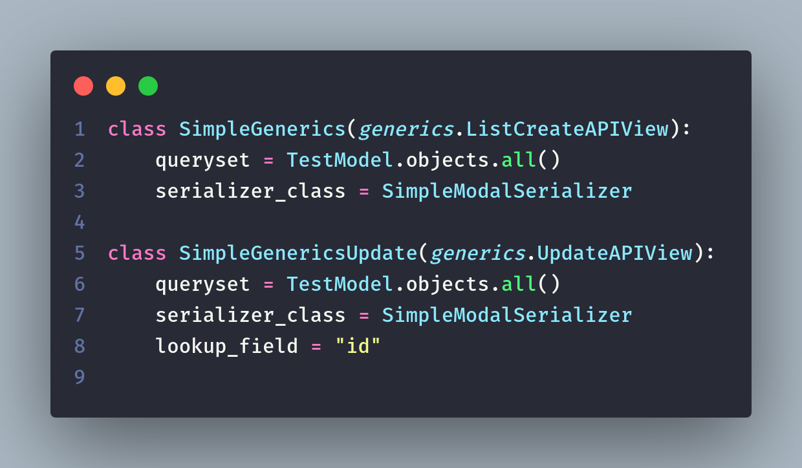

# TestDjangoRest

## Tutorial

[https://www.youtube.com/playlist?list=PLo7TNe_pEoMXcsc1dOaFyVGcZK8o-6CCW](https://www.youtube.com/playlist?list=PLo7TNe_pEoMXcsc1dOaFyVGcZK8o-6CCW)

## Hoc ve Models



```
    Hoc ve Models
    - cac loai Field co trong django rest
    - def __str__(self): | => format hien thi object tren admin page
    - class Meta: | => them chuc nang sap xep object theo Field, chinh name hien thi cua Model
    - def save(self, *args, **kwargs): | => action while save data in db
```


```
    - ForeignKey chu y: co cac kieu on_delete khac nhau
```


```
    - OneToOneField chu y: co cac kieu on_delete khac nhau, quan he 1-1
```

## Hoc ve Views


`tao mot api request don gian`


```
    dung APIView: khong co serializer: postMethod phai tao chay nhu tren
```


```
    dung APIView: co su dung serializer: postMethod ngan gon
```

## Hoc Serializers


```
    dung serializer.Serializer :
    - phai viet ham create, update de khi post va put .save() map voi funtion tren
```


```
    su dung ModalSerializer: duoc ho tro het
```

## quay lai voi Views



```
    generics: ho tro api GET POST PUT DELETE
    Chu y: generics.UpdateAPIView tham so default la 'pk'.
    Muon thay doi phai set: lookup_field ="name_field"
```


```
    dung viewSets.ModelViewSet: ho tro tu a -> z
```

## Hoc ve Urls

` Co hai kieu dung`


## Setting postgresql


```
    pip install psycopg2-binary
```

### Docker-compose setup

```
version: "3"

services:
    postgres:
        container_name: postgres_container
        image: postgres
        environment:
            POSTGRES_USER: admin
            POSTGRES_PASSWORD: admin123
            PGDATA: /data/postgres
        volumes:
            - postgres:/data/postgres
        ports:
            - "5000:5432"
        networks:
            - postgres
        restart: unless-stopped
networks:
    postgres:
        driver: bridge
volumes:
    postgres:

```

# Tool su dung

## Using django-seed sinh data ngau nhien

```
pip install django-seed
khai bao "django_seed" trong setting

python manage.py seed new_app --number=10
```

## debug_toolbar

```
pip install django-debug-toolbar
khai bao "debug_toolbar" trong setting
```
